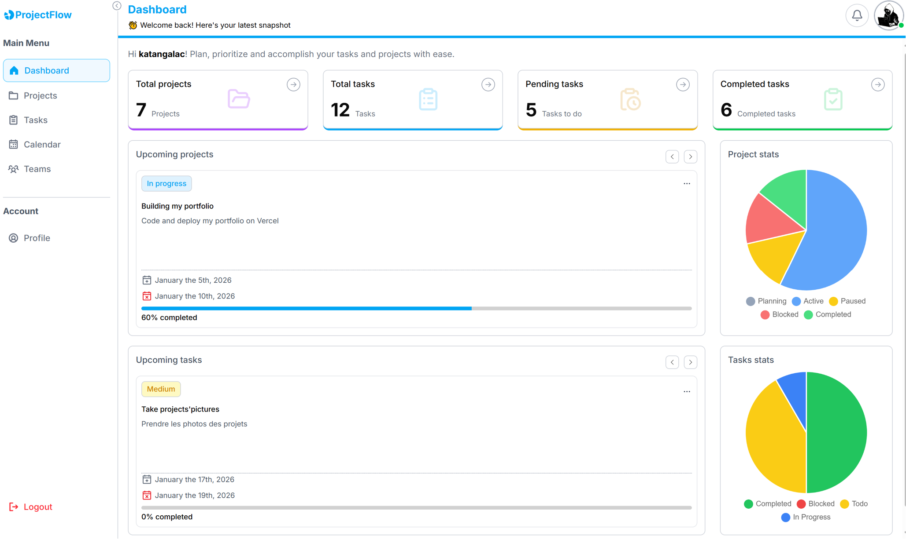
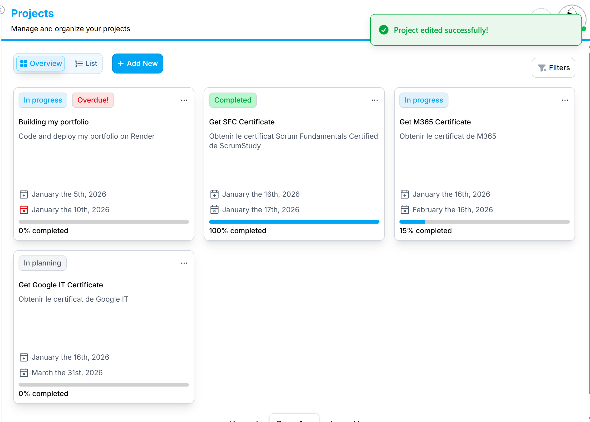
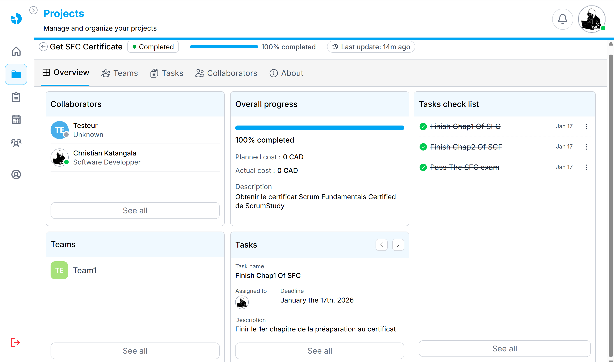
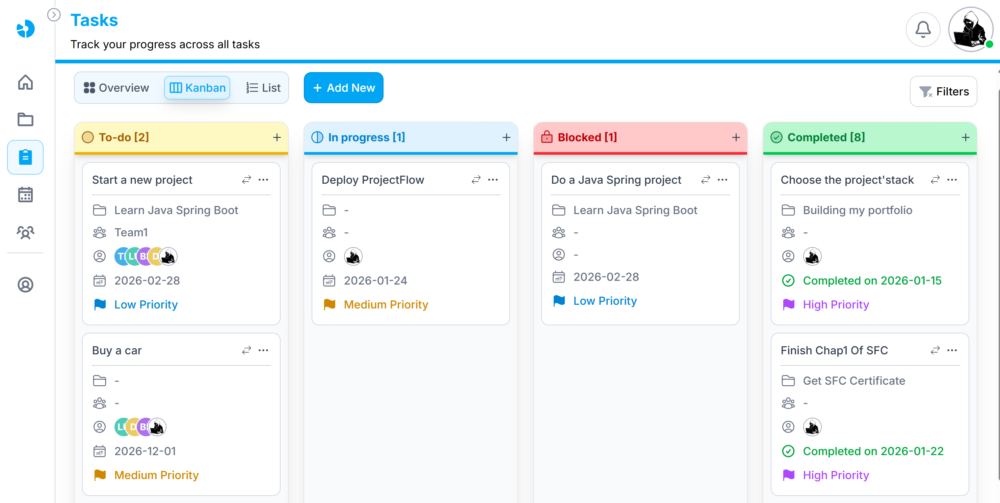
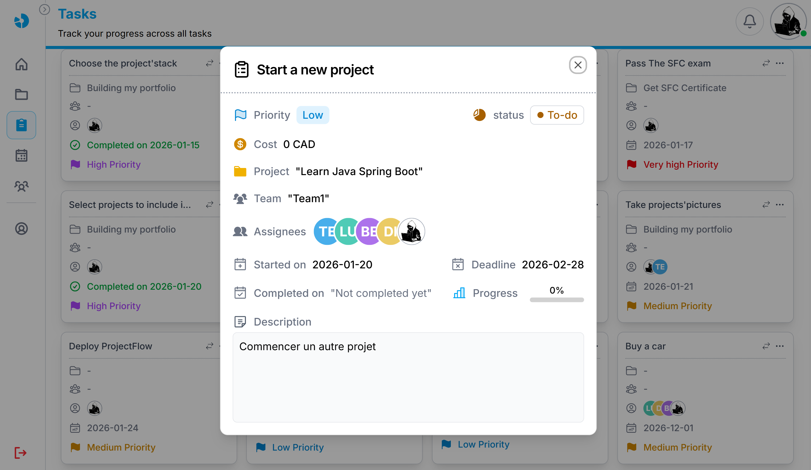
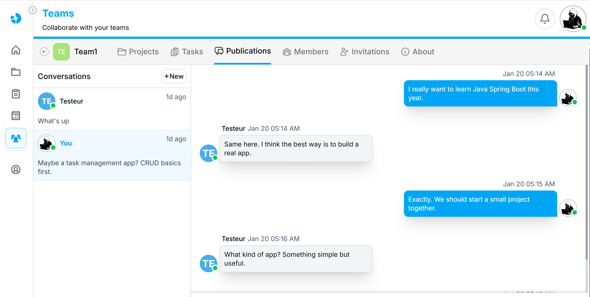
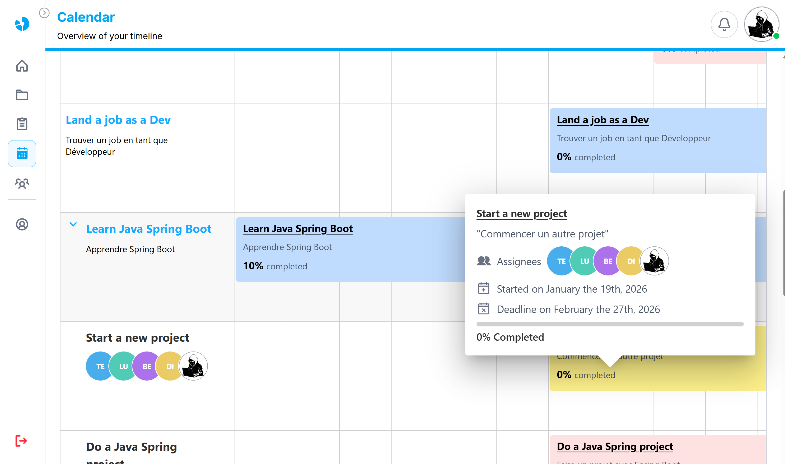

# Project & Task Management Application

## ✅ Project & Task Management App

A collaborative web application designed to manage projects and tasks, track progress, and communicate in real time with team members.

## ✨ Key Features

- Project creation and management

- Task management (status, priority, progress)

- Real-time communication

- User notification

- Shared state synchronization across users

## 🛠️ Tech Stack

- Frontend: React,Typescript, TailwindCSS

- Backend: Node.js, Express, Typescript

- Database: PostgreSQL

- Images storage : Uploadcare

- ORM: Prisma

- Emails : Resend

- Real-time: WebSockets

- Caching: Redis 

- State management: Zustand

## 🧠 Skills & Concepts

- Full-stack application architecture

- Real-time communication using WebSockets

- Client-side state management

- JWT-based authentication

- Building scalable and collaborative systems

## 🖼️ Application Preview

### Dashboard

### Project DashBoard

### Project Detail

### Task Dashboard - kanban

### Task Detail

### Real-time communication

### scheduler

